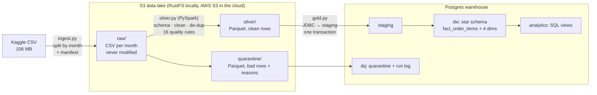
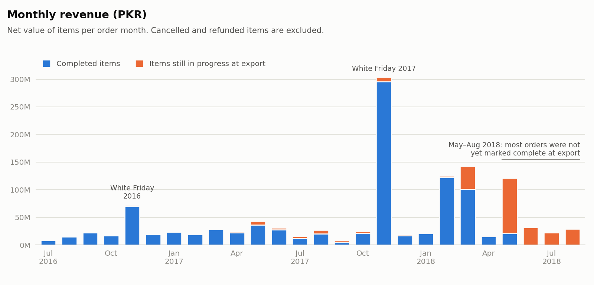
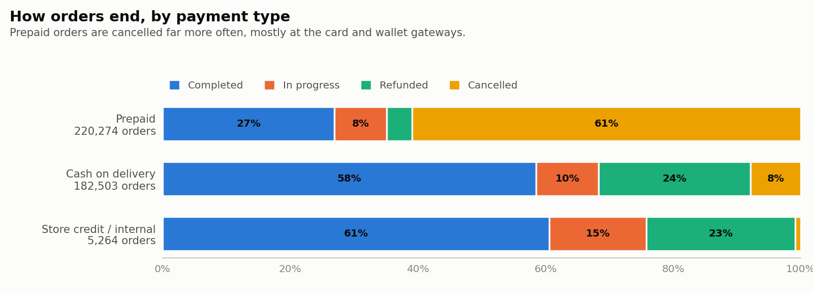
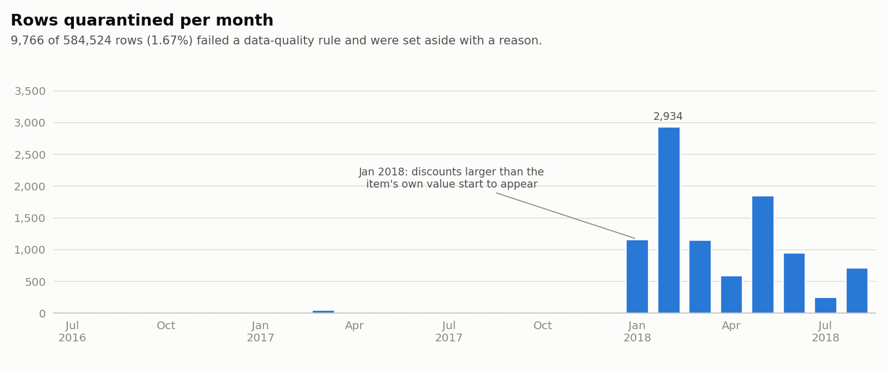
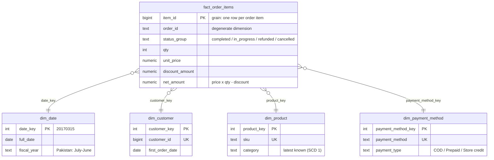

# Pakistan E-Commerce Data Pipeline

[](https://github.com/Adilmp/pk-ecommerce-pipeline/actions/workflows/ci.yml)


A batch data pipeline for **Pakistan's largest public e-commerce dataset**: 584,524 order items
from July 2016 to August 2018. Monthly batches land in an S3 data lake, are cleaned and validated
with **PySpark**, and are loaded into a **Postgres star schema**, where SQL answers the business
questions. Every row is accounted for: clean rows reach the warehouse, and bad rows are
quarantined with the reason.

| | |
|---|---|
| Rows read | **584,524** (from an Excel export filled to Excel's 1,048,576-row limit: 44% was blank padding) |
| Loaded into the warehouse | **574,758** order items · 408,041 orders · 115,117 customers · 83,373 products |
| Quarantined, with reasons | **9,766** (1.67%) |
| Completed revenue | **PKR 965.2 million** |
| Full 26-month backfill | **~4 minutes** on a laptop, one command |
| Tests | 50 unit tests + an end-to-end test in CI |
| Security | Services on localhost only, no secrets in git, checksummed and scanned dependencies ([SECURITY.md](docs/SECURITY.md)) |
| Scheduling | Makefile/CLI, or an optional Airflow DAG (one run per month, catch-up backfill) |

## Architecture



**In five steps:**
1. **Ingest:** the source CSV is split into monthly files, as if each month arrived separately,
   and landed untouched in the lake with a manifest (row count + checksum).
2. **Clean (PySpark):** each month is read with an explicit schema, standardised, typed,
   de-duplicated and checked against 16 data-quality rules.
3. **Quarantine:** rows failing a rule are set aside with every reason code and their raw values.
   Nothing is silently dropped.
4. **Load:** clean rows go into a star schema (grain: one row per order item) in one
   transaction per month. Rerunning a month never creates duplicates.
5. **Analyse:** SQL views answer the business questions; the charts below come from them.

## What the data shows

<picture>
  <source media="(prefers-color-scheme: dark)" srcset="docs/images/monthly-revenue-dark.png">
  
</picture>

- **White Friday** (Pakistan's Black Friday) dominates: November 2017 alone brought in PKR 296M
  of completed revenue, **31% of all 26 months**.
- **Mobiles & Tablets** are 48% of completed revenue.
- **The last months aren't a collapse.** From May 2018 almost no orders were marked *complete*
  when the data was exported, so their value shows as *in progress*. A naive revenue chart would
  show sales falling to zero.
- **Customers rarely come back quickly:** on average only ~11% of a month's new customers order
  again the next month (`analytics.customer_cohorts`).

<picture>
  <source media="(prefers-color-scheme: dark)" srcset="docs/images/payment-outcomes-dark.png">
  
</picture>

| Payment type | Orders | Completed | In progress | Refunded | Cancelled |
|---|---:|---:|---:|---:|---:|
| Prepaid (cards, wallets, bank, vouchers) | 220,274 | 26.9% | 8.2% | 4.0% | 60.9% |
| Cash on delivery | 182,503 | 58.5% | 9.8% | 23.8% | 7.9% |
| Store credit / internal | 5,264 | 60.6% | 15.2% | 23.3% | 0.9% |

Prepaid orders are cancelled **almost 8× as often** as cash on delivery, mostly at the card and
wallet gateways, which fits failed or abandoned online payments. Cash-on-delivery orders are
refunded more, which fits returns after delivery.

<details>
<summary><b>All 26 months as a table</b></summary>

| Month | Orders | Net revenue (PKR M) | Open orders (PKR M) | Cancelled orders | Rows quarantined |
|---|---:|---:|---:|---:|---:|
| 2016-07 | 7,265 | 8.3 | 0.0 | 14.8% | 0 |
| 2016-08 | 9,945 | 15.1 | 0.1 | 11.4% | 1 |
| 2016-09 | 13,134 | 22.5 | 0.2 | 35.6% | 1 |
| 2016-10 | 10,877 | 17.3 | 0.4 | 25.9% | 3 |
| 2016-11 | 55,450 | 69.9 | 2.6 | 34.5% | 0 |
| 2016-12 | 10,989 | 19.6 | 0.8 | 20.8% | 3 |
| 2017-01 | 10,073 | 23.6 | 1.1 | 24.8% | 0 |
| 2017-02 | 8,754 | 19.0 | 0.7 | 24.1% | 8 |
| 2017-03 | 13,539 | 28.7 | 1.2 | 28.4% | 60 |
| 2017-04 | 12,239 | 22.2 | 2.5 | 29.5% | 15 |
| 2017-05 | 20,813 | 36.4 | 6.9 | 44.9% | 5 |
| 2017-06 | 10,714 | 27.9 | 3.6 | 37.0% | 8 |
| 2017-07 | 10,089 | 12.4 | 3.3 | 22.8% | 6 |
| 2017-08 | 13,741 | 20.7 | 6.5 | 30.2% | 3 |
| 2017-09 | 5,896 | 5.8 | 2.9 | 32.4% | 0 |
| 2017-10 | 12,739 | 21.6 | 2.8 | 46.9% | 2 |
| 2017-11 | 57,241 | 295.6 | 8.1 | 36.7% | 3 |
| 2017-12 | 9,974 | 17.3 | 1.8 | 33.5% | 1 |
| 2018-01 | 8,177 | 20.9 | 1.2 | 33.7% | 1,168 |
| 2018-02 | 18,880 | 122.2 | 3.0 | 39.5% | 2,934 |
| 2018-03 | 35,094 | 100.8 | 41.7 | 54.1% | 1,159 |
| 2018-04 | 7,731 | 15.7 | 2.2 | 32.6% | 599 |
| 2018-05 | 19,795 | 21.4 | 99.5 | 46.5% | 1,853 |
| 2018-06 | 9,597 | 0.0 | 31.9 | 51.3% | 954 |
| 2018-07 | 7,479 | 0.0 | 22.1 | 54.1% | 257 |
| 2018-08 | 7,816 | 0.0 | 29.1 | 45.4% | 723 |

</details>

## Data quality

The data was profiled before anything was designed ([DATA_PROFILE.md](docs/DATA_PROFILE.md)).
The problems it found:

- **The file is an Excel export**, padded to Excel's 1,048,576-row limit (464,051 blank lines),
  with formula columns and Excel errors (`#REF!`, `#N/A`) leaking into the data.
- **`grand_total` is the order total repeated on every item.** Summing it would count a
  3-item order three times, so revenue is computed per item instead (price × qty − discount).
- **9,713 discounts are larger than the item's own value** (negative revenue).

<picture>
  <source media="(prefers-color-scheme: dark)" srcset="docs/images/quarantine-by-month-dark.png">
  
</picture>

| Quarantine reason | Rows |
|---|---:|
| `DISCOUNT_EXCEEDS_LINE`: discount larger than price × qty | 9,713 |
| `MISSING_SKU` | 20 |
| `MISSING_STATUS` | 19 |
| `INVALID_CUSTOMER_ID`: `#N/A` from a failed Excel lookup | 11 |
| `NEGATIVE_DISCOUNT` | 3 |

The problem starts abruptly in **January 2018**. That looks like a change in the source system,
which is exactly what a quarantine table is for: it's visible, measurable and reprocessable
instead of silently dropped.

**Every stage proves its row counts add up.** The pipeline stops if:
1. Spark reads a different number of rows than ingest wrote. This check **caught a real bug**:
   line breaks inside 11 quoted SKUs made Spark split a row in two.
2. Rows read ≠ clean + quarantined + duplicates.
3. Rows loaded into the warehouse ≠ rows staged.

The final results were also checked month by month against an independent plain-Python
implementation of the same rules. All 26 months match exactly, including total revenue, to the paisa.

## Data model



Analytics views: `monthly_kpis` (growth with `LAG`, running totals), `category_performance`,
`top_products_by_category` (`ROW_NUMBER`), `payment_type_outcomes`, `customer_cohorts`
(retention), `dq_error_summary` and more, in [`sql/analytics/`](sql/analytics).

## Run it yourself

**You need:** Docker with Compose, ~6 GB free RAM, and the dataset.

1. Download [Pakistan's Largest E-Commerce Dataset](https://www.kaggle.com/datasets/zusmani/pakistans-largest-ecommerce-dataset)
   from Kaggle (free login) and save the CSV as `data/raw/pakistan_ecommerce.csv`.
2. Run everything:

```bash
make all
```

That builds the image, starts RustFS and Postgres, creates the tables, ingests the 26 months,
runs the backfill and prints the report. Afterwards:

| Command | What it does |
|---|---|
| `make run MONTH=2017-11` | Reprocess one month (safe to repeat) |
| `make report` | Print the headline numbers |
| `make psql` | SQL shell in the warehouse, e.g. `SELECT * FROM analytics.monthly_kpis;` |
| `make charts` | Regenerate the charts |
| `make airflow` | Optional: start Airflow on http://localhost:8080; it backfills every month itself |
| `make test` · `make test-e2e` · `make lint` | Unit tests · end-to-end test · lint |
| `make security` | Scan for leaked secrets, vulnerable dependencies and Docker misconfigurations |
| `make down` · `make clean` | Stop (keep data) · stop and delete all data |

The lake's web console is at http://localhost:9001/rustfs/console/ (credentials are in `.env`).

### Scheduling with Airflow (optional)

`make airflow` starts Airflow 3 with one DAG, [`pk_ecommerce_monthly`](airflow/dags/pk_ecommerce_monthly.py):
one DAG run per order month, each running **ingest → silver → gold**. Each run covers one month
as its *data interval* and starts once that month is over (the March run starts on 1 April). With
`catchup=True`, Airflow creates a run for every month from July 2016 to August 2018 and processes
them in order, so **Airflow performs the backfill itself**. Retries are safe because every task is idempotent.
The Airflow image is built on top of the pipeline image, so tasks run exactly the same code. A
full Airflow backfill leaves the warehouse identical to `make backfill`.
To run the lake on **AWS S3** instead, change `.env`; see [docs/AWS.md](docs/AWS.md).

## Design decisions

29 decisions are written up in [DECISIONS.md](docs/DECISIONS.md). The most important:

- **Idempotent, month-by-month loads:** a failed run is fixed by running it again (D10), which
  is also what makes Airflow's retries and catch-up safe (D15).
- **Quarantine, never drop:** with reason codes and raw values (D9, D16).
- **Revenue at the item grain**, because `grand_total` is order-level (D18).
- **Raw is immutable**, so any bug can be fixed and replayed (D3). This was used for real to
  fix the CSV bug.
- **Only the S3 API:** when MinIO's images were removed from Docker Hub in September 2026,
  switching to RustFS took one line (D4).
- **Spark tuned for small batches,** including diagnosing an out-of-memory error during query
  *planning* (D24).
- **Honest trade-off:** at 0.5M rows pandas would be faster; Spark was chosen so the design scales
  (D7).
- **Security reviewed:** services listen on localhost only, jars are checksum-verified, CI scans
  for secrets and CVEs, and on AWS it runs on an IAM role with no keys (D27–D29).

## Project structure

```
├── src/pipeline/
│   ├── ingest.py        # CSV → lake, one file per month + manifest
│   ├── transform.py     # pure DataFrame functions (unit-tested)
│   ├── quality.py       # the 16 data-quality rules + business mappings
│   ├── silver.py        # raw → silver + quarantine, reconciliation checks
│   ├── gold.py          # silver → staging → star schema (one transaction)
│   ├── run.py           # CLI: --month / --all, run log
│   └── charts.py, report.py, init.py, config.py, spark.py, storage.py, db.py
├── sql/
│   ├── schema/          # star schema, quarantine, run log, staging
│   ├── load/            # idempotent upserts and delete + insert
│   └── analytics/       # business views
├── airflow/             # optional: DAG (one run per month) + image built on the pipeline image
├── tests/
│   ├── unit/            # 50 tests, no services needed
│   ├── e2e/             # full pipeline on a fixture, own bucket + database
│   └── fixtures/        # 12-row CSV with one example of each real problem
├── docs/                # decisions, data profile, build steps, AWS, security
├── docker-compose.yml · Dockerfile · Makefile · .env.example
└── .github/workflows/ci.yml
```

## Docs

| | |
|---|---|
| [DECISIONS.md](docs/DECISIONS.md) | Why every choice was made (29 decisions) |
| [DATA_PROFILE.md](docs/DATA_PROFILE.md) | What the raw data really looks like (12 findings) |
| [STEPS.md](docs/STEPS.md) | How it was built, step by step |
| [AWS.md](docs/AWS.md) | Running the lake on AWS S3 |
| [SECURITY.md](docs/SECURITY.md) | Security review: findings, fixes, scans and accepted risks |

## Data

[Pakistan's Largest E-Commerce Dataset](https://www.kaggle.com/datasets/zusmani/pakistans-largest-ecommerce-dataset)
by Zeeshan-ul-hassan Usmani, on Kaggle. The data is **not** included in this repository;
download it from Kaggle. The test fixture is synthetic.

Code: [MIT License](LICENSE). Built by [Adil Pervez](https://www.linkedin.com/in/adil-muhammad-pervez).
